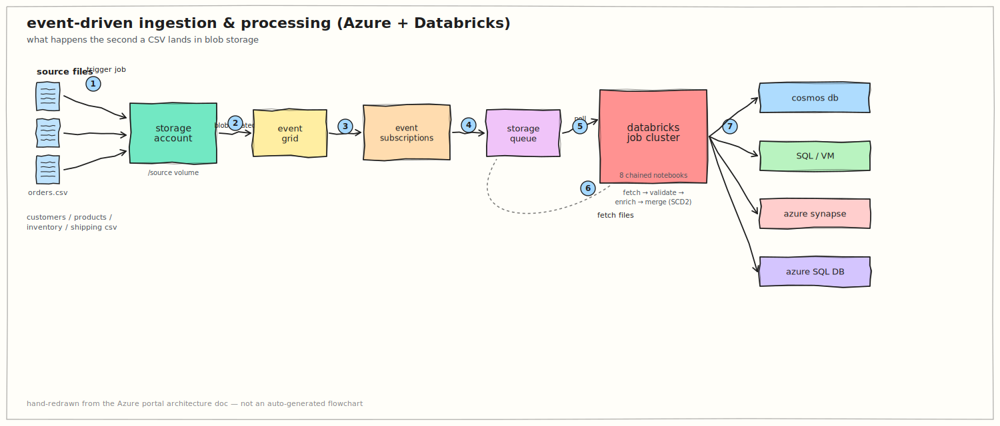
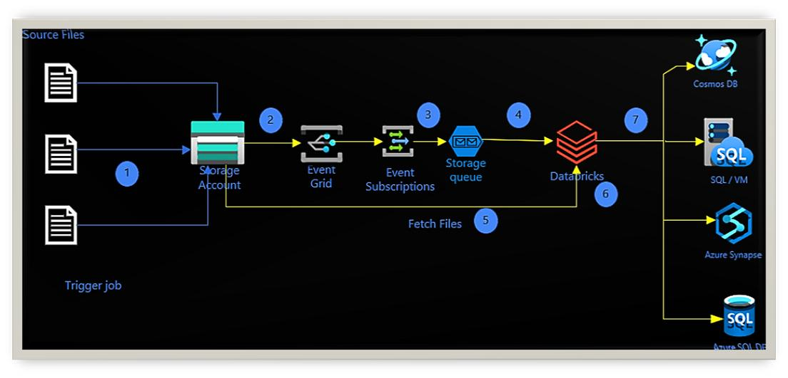
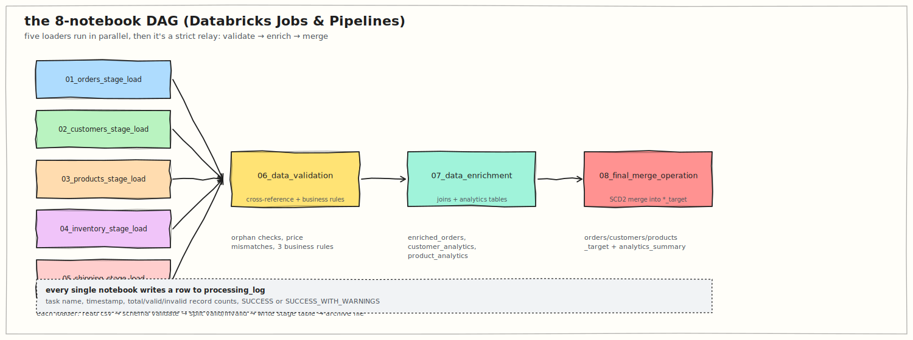
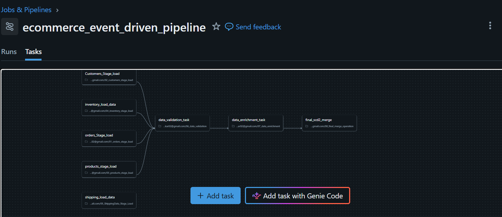
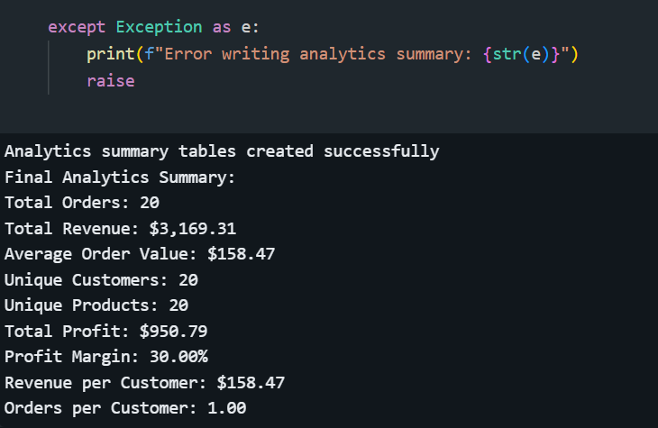
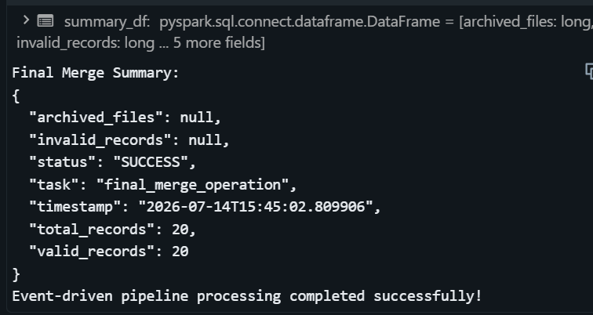
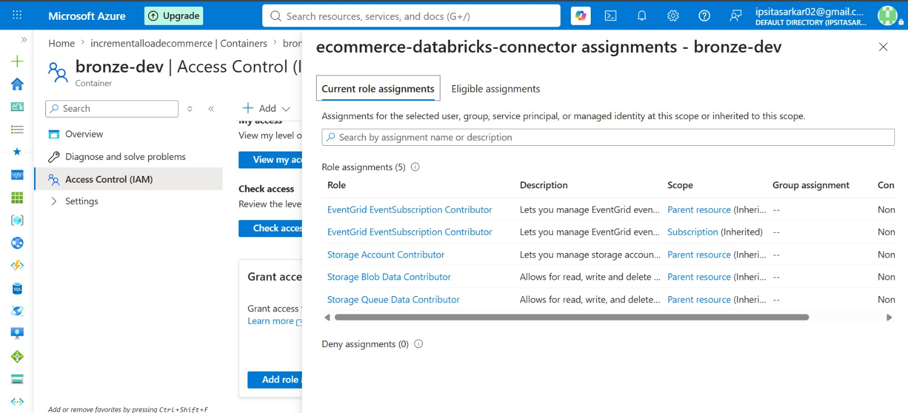

# ecommerce-incremental-load

A pragmatic event-driven data pipeline for ecommerce CSV feeds, built to run in Azure Databricks with Delta Lake staging, validation, enrichment, and SCD2 history.

This repo is the handoff document for a pipeline that is meant to be run, observed, and debugged by another engineer. It is not marketing copy —it is a map of how the pipeline is wired, where data quality is enforced, and what to watch for after a run.

---

## What this repo is for

It exists because raw ecommerce CSV feeds are arriving into Azure Blob Storage and those files need to be turned into analytics-ready tables without losing history.

What it solves:

- captures source data as soon as a file lands
- isolates raw ingestion from business logic
- validates cross-feed consistency before enrichment
- preserves history with SCD2 instead of overwriting target rows
- keeps failure evidence in Delta tables so bad rows are visible

This is the kind of pipeline I would hand over with a “run it, then inspect `processing_log` and `validation_results` first” note attached.

---

## High-level flow

         ```svg
<svg xmlns="http://www.w3.org/2000/svg" width="980" height="980" viewBox="0 0 980 980">
  <defs>
    <style>
      .box {
        fill: #ffffff;
        stroke: #333333;
        stroke-width: 2;
        rx: 10;
        ry: 10;
      }
      .title {
        font-family: Arial, Helvetica, sans-serif;
        font-size: 18px;
        font-weight: bold;
        fill: #222;
      }
      .text {
        font-family: Arial, Helvetica, sans-serif;
        font-size: 15px;
        fill: #444;
      }
      .arrow {
        stroke: #444;
        stroke-width: 2.5;
        fill: none;
        marker-end: url(#arrowhead);
      }
    </style>

    <marker id="arrowhead"
            markerWidth="10"
            markerHeight="7"
            refX="8"
            refY="3.5"
            orient="auto">
      <polygon points="0 0, 10 3.5, 0 7" fill="#444"/>
    </marker>
  </defs>

  <!-- Top -->
  <rect class="box" x="280" y="20" width="420" height="95"/>
  <text class="title" x="490" y="48" text-anchor="middle">CSVs arrive in Blob</text>
  <text class="text" x="490" y="72" text-anchor="middle">orders, customers, products,</text>
  <text class="text" x="490" y="92" text-anchor="middle">inventory, shipping</text>

  <line class="arrow" x1="490" y1="115" x2="490" y2="150"/>
  <text class="text" x="510" y="138">blob-created event</text>

  <!-- Event Grid -->
  <rect class="box" x="260" y="150" width="460" height="85"/>
  <text class="title" x="490" y="180" text-anchor="middle">Event Grid → Storage Queue</text>
  <text class="text" x="490" y="205" text-anchor="middle">Single event, buffered message</text>

  <line class="arrow" x1="490" y1="235" x2="490" y2="275"/>
  <text class="text" x="510" y="260">queue poll / task trigger</text>

  <!-- Loader -->
  <rect class="box" x="270" y="275" width="440" height="90"/>
  <text class="title" x="490" y="305" text-anchor="middle">Databricks Loader Tasks</text>
  <text class="text" x="490" y="330" text-anchor="middle">01–05 stage_load notebooks</text>

  <!-- Vertical arrows -->
  <line class="arrow" x1="220" y1="365" x2="220" y2="430"/>
  <line class="arrow" x1="355" y1="365" x2="355" y2="430"/>
  <line class="arrow" x1="490" y1="365" x2="490" y2="430"/>
  <line class="arrow" x1="625" y1="365" x2="625" y2="430"/>
  <line class="arrow" x1="760" y1="365" x2="760" y2="430"/>

  <!-- Stage Boxes -->
  <rect class="box" x="155" y="430" width="130" height="75"/>
  <text class="title" x="220" y="458" text-anchor="middle">Orders</text>
  <text class="text" x="220" y="482" text-anchor="middle">Stage</text>

  <rect class="box" x="290" y="430" width="130" height="75"/>
  <text class="title" x="355" y="458" text-anchor="middle">Customers</text>
  <text class="text" x="355" y="482" text-anchor="middle">Stage</text>

  <rect class="box" x="425" y="430" width="130" height="75"/>
  <text class="title" x="490" y="458" text-anchor="middle">Products</text>
  <text class="text" x="490" y="482" text-anchor="middle">Stage</text>

  <rect class="box" x="560" y="430" width="130" height="75"/>
  <text class="title" x="625" y="458" text-anchor="middle">Inventory</text>
  <text class="text" x="625" y="482" text-anchor="middle">Stage</text>

  <rect class="box" x="695" y="430" width="130" height="75"/>
  <text class="title" x="760" y="458" text-anchor="middle">Shipping</text>
  <text class="text" x="760" y="482" text-anchor="middle">Stage</text>

  <!-- Merge -->
  <line class="arrow" x1="490" y1="505" x2="490" y2="555"/>
  <text class="text" x="510" y="540">All feeds landed and typed</text>

  <!-- Validation -->
  <rect class="box" x="280" y="555" width="420" height="85"/>
  <text class="title" x="490" y="585" text-anchor="middle">06_data_validation</text>
  <text class="text" x="490" y="610" text-anchor="middle">Cross-feed integrity checks</text>

  <line class="arrow" x1="490" y1="640" x2="490" y2="685"/>

  <!-- Enrichment -->
  <rect class="box" x="280" y="685" width="420" height="90"/>
  <text class="title" x="490" y="715" text-anchor="middle">07_data_enrichment</text>
  <text class="text" x="490" y="740" text-anchor="middle">Analytics-ready joins +</text>
  <text class="text" x="490" y="760" text-anchor="middle">Derived attributes</text>

  <line class="arrow" x1="490" y1="775" x2="490" y2="820"/>

  <!-- Final -->
  <rect class="box" x="280" y="820" width="420" height="90"/>
  <text class="title" x="490" y="850" text-anchor="middle">08_final_merge_operation</text>
  <text class="text" x="490" y="875" text-anchor="middle">SCD Type 2 Merge to Target</text>

</svg>
```

You can save this as `pipeline.svg` and open it in any browser or import it directly into Figma, Excalidraw (as SVG), PowerPoint, or your README. It is fully editable since it's pure SVG.


Notes:

- `01`–`05` are ingestion and staging work. They are intentionally lightweight and isolated.
- `06` validates across feeds. It must run after all staged tables exist.
- `07` only runs once the data is structurally correct and consistent enough for analytics.
- `08` is a write-heavy merge stage; it should be the last step.

---

## What each notebook does

### `01_orders_stage_load.ipynb`

Loads orders from blob CSV into a Delta stage table.

Key behaviour:

- explicit schema, no schema inference
- `batch_id` and `processed_timestamp` added
- valid rows written to `orders_stage`
- invalid rows written to an error table with reason codes
- source file moved to `archive/`

Why this exists:

The staging layer is the first point where raw CSV becomes structured data. It also ensures bad rows are quarantined rather than silently dropped.

### `02_customers_stage_load.ipynb`

Loads customer records and enriches them with simple lifecycle segments.

What it checks:

- `customer_id`, `email`, `phone` must be present
- date of birth cannot be in the future
- email pattern sanity

What it derives:

- age segment (Gen Z / Millennial / Gen X / Boomer+)
- customer lifecycle stage (New / Active / Established)

### `03_products_stage_load.ipynb`

Parses product metadata and computes stock/lifecycle indicators.

What it does:

- validates `product_id` and `price`
- parses dimensions from `LxWxH`
- computes volume, density, and price segment
- flags discontinued or low-stock products

### `04_inventory_stage_load.ipynb`

Ingests inventory snapshots and enforces stock consistency.

Checks include:

- `inventory_id` is present
- quantities are non-negative
- stock utilization is calculated
- overdue audits are flagged

### `05_ShippingData_Stage_Load.ipynb`

Loads shipping records and compares actual delivery performance.

Enrichments include:

- on-time / slightly delayed / delayed labels
- cost per kilogram
- validation of shipping cost and weight

### `06_data_validation.ipynb`

This notebook is the most important quality gate.

It does not just validate one feed. It validates the relationship between all five feeds.

Checks include:

- orphan orders / missing customers
- orders linked to missing products
- shipping records without matching orders
- product records never ordered
- price mismatches versus product list prices
- time-of-day and order amount sanity checks

It writes results to `validation_results` and publishes a pass/fail flag for the next task.

### `07_data_enrichment.ipynb`

Joins the five staged feeds into analytics-ready outputs.

Outputs include:

- `enriched_orders`
- `customer_analytics`
- `product_analytics`

This notebook is where business context is added: margins, lifecycle labels, customer segments, product performance tiers.

### `08_final_merge_operation.ipynb`

Performs the SCD2 merge into target tables.

The process is:

1. detect changed rows
2. expire current versions (`is_current = false`)
3. append new versions with `effective_date`
4. keep full history in the same table

This is the final commit point for the pipeline.

---

## Why this design

I chose explicit staging because it makes debugging and retries easier.

If a feed fails in `02`, I can fix the CSV and re-run only that notebook. I don't have to rerun the entire pipeline from raw file ingestion.

Validation is separate because the cross-feed checks are not the same thing as row-level schema validation. A row can be internally valid and still be bogus if it points at the wrong customer or product.

The merge stage preserves row history instead of overwriting it, which is the safer choice when dimensions change over time.

---

## Architecture sketch

           ┌─────────────────────────────┐
           │ Azure Blob Storage (landing) │
           └───────────┬─────────────────┘
                       │ CSV file arrival
                       ▼
            ┌───────────────────────────┐
            │ Event Grid / Storage Queue │
            │ buffer the file event      │
            └───────────┬───────────────┘
                        │ queue pull
                        ▼
       ╭────────────────────────────────────────╮
       │ Databricks job starts loader notebooks │
       │ 01–05: one notebook per feed          │
       ╰────────────────────────────────────────╯
                    │  │  │  │  │
                    │  │  │  │  │
                    ▼  ▼  ▼  ▼  ▼
              load -> stage tables and archives
                    │
                    ▼
       ╭──────────────────────────────────╮
       │ 06_data_validation                │
       │ cross-feed integrity checks      │
       ╰──────────────────────────────────╯
                    │
                    ▼
       ╭──────────────────────────────────╮
       │ 07_data_enrichment                │
       │ build analytics-ready outputs    │
       ╰──────────────────────────────────╯
                    │
                    ▼
       ╭──────────────────────────────────╮
       │ 08_final_merge_operation          │
       │ SCD2 history writes               │
       ╰──────────────────────────────────╯

Notes on the sketch:

- the blob event does not go directly to Databricks; it is buffered in a queue first.
- stage tables are the first durable checkpoint.
- validation is the first place where all feeds are compared.
- enrichment is where analytical context is created.
- merge is the final durable write.

---

## Key diagrams and screenshots

The image assets are stored alongside this README in `files/`, with additional visual references in the sibling `images/` directory.

### Architecture reference






### Pipeline flow and runtime






### Execution evidence






### Security and access



---

## Operations and troubleshooting

What to check first after a failed run:

- `processing_log` for the notebook that failed
- `validation_results` for high-severity rows
- whether the source CSV was archived successfully
- whether the queue message was processed more than once
- whether the target table merge step has partially updated rows

A common mistake:

The job currently logs validation results but does not stop on medium or low severity automatically. That means a run can continue even when the data is not ideal, so the engineer should inspect the validation table before trusting downstream analytics.

If you need a quick recovery path:

- fix the source file in landing
- re-run only the failed loader notebook if the issue is at ingestion
- if the issue is a cross-feed mismatch, fix the table or source file and re-run `06_data_validation` then `07_data_enrichment`
- only re-run `08_final_merge_operation` when the upstream feed is stable and the target state is understood

---

## File layout from this README

- `01_orders_stage_load.ipynb`
- `02_customers_stage_load.ipynb`
- `03_products_stage_load.ipynb`
- `04_inventory_stage_load.ipynb`
- `05_ShippingData_Stage_Load.ipynb`
- `06_data_validation.ipynb`
- `07_data_enrichment.ipynb`
- `08_final_merge_operation.ipynb`
- `architecture-diagram.svg`
- `pipeline-dag.svg`
- `original-azure-diagram.jpg`
- `databricks-job-graph.png`
- `analytics-summary-run.png`
- `final-merge-run.png`
- `iam-role-assignments.jpeg`

---

## What the next engineer should take away

- The most important tables to inspect are `processing_log` and `validation_results`.
- The notebook order is intentional: stage -> validate -> enrich -> merge.
- This repo is structured for handoff, not for experimentation. If you change the pipeline order or merge semantics, document it here.
- The next improvement would be turning `validation_results` into a gating mechanism rather than passive logging.

*This README is written as a practical handoff note, not a polished external summary.*
